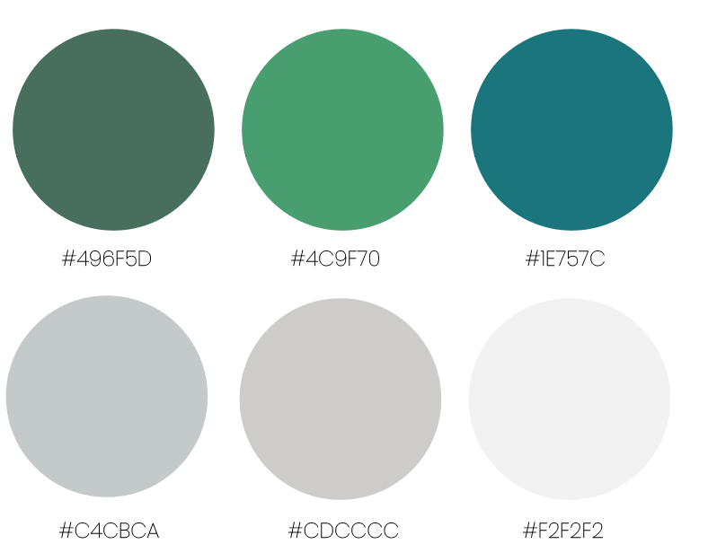

# Luv 4-Wheels 
# Milestone Project 1 - Static Front-End Website 

* DISCLAIMER: Luv 4-wheels is a finctional bussiness. This website is for the developers portfolio and completions of "Code Institute's course"

# Live Project 

[View live project here](https://jjbr13.github.io/Justin-Brown-milestone-project-one/)

# Repository 

[Locate project repository here](https://github.com/JJBR13/Justin-Brown-milestone-project-one)

# Contents

- [User Experience](#user-eperience)
   * [User Stories](#user-stroies)
     + [Holiday Bound Clients](#holiday-bound-clients)
     + [Limited Holiday Options](#limited-holiday-options)
     + [Travel Broker](#travel-broker)
- [Design](#design)
    + [Colour Palette](#colour-palette)
    + [Typography](#typography)
    + [Images](#images)
- [Website Constuction](#website-constuction)
    + [Website Layout](#webpage-layout)
    + [Nav-bar](#nav-bar)
    + [404 Error Page](#404-error-page)
    + [Form Submission Pages](#submission-pages)
- [Current Features](#current-features)
    + [Responsive On All Devices](#responsive-on-all-devices)
- [Future Releases](#future-releases)
    + [Adding More Content](#adding-more-content)
    + [Booking System](#booking-system)
    + [App](#app)
- [Languages Used](#languages-used)
- [Testing](#testing)
- [Libraries, Frameworks & Programs](#libraries-frameworks--programs)
- [Deployment](#depolyment)
    + [GitHub Pages](#github-pages)
- [References & Credit](#references--credit)
    + [Logo Creation](#logo-creation)

# User Experience

## User Stories 

### Holiday Bound Clients 

*These are users already looking for a holiday or been referred by family, friends or existing clients.*

* Want to see variety and style of campervans available to hire. 
* Information on the different vans, allowing educated choice that best suits them. 
* Easy viewing, not stressful and allowing easily contactable. 

### Limited Holiday Options 

*Defining the user that may have limiting factors for their holiday away. For example,someone who dislikes flying or leave wanting a domestic holiday.*

* I want a taste of whether this is a holiday I want to go on. 
* Be able to contact support with easily, with concerns or questions that may need answers. 
* See previous customer comments, allowing trust within the company. 

### Travel broker 

*Travel agents who collaborate with the company to book vans throughout the year* 

* There are travel companies within the industry that use Luv 4-Wheels to provide options to prospective clients as a holiday option.
* Easy to navigate site to be able to show prospective clients the holiday services offered.
* Up-to-date gallery of images of the van and locations travelled to create insight and hype for the customer.

## Design 

### Colour Palette
 

- The simple, fresh, natural scheme was selected. To reflect the adventures of the outdoors, with the green and blue contrasting whites and to maintain the vibe.

- This palette was selected to complete the heavy use of images, to soothe and complement them.

### Typography 

[*Sourced via google fonts.*](https://fonts.google.com/) 

- Headings: used "Lobster". This is a creative, modern, flowing font, allowing a quirky vibe through the site.

- Body: Using "Open Sans", is a screen-friendly font. This font is simple and readable, allowing easy processing. 

### Images 

- Imagery was a highly important aspect of this site, as the site's aim was to transport the user into imagining themselves on adventures or holidays in one of the vans.

- This was achieved throughout the site:
    - Having a hero section on both the home and view-van pages was used to capture the attention of the user.
    - The homepage incorporated the "wanderlust gallery," allowing the user to see and imagine themselves within the vans and different locations. 
    - Under each option of van, a carousel of images slides indefinitely, showing images of the specific type of van.

## Website Constuction 

### Webpage Layout 

 [Click here for Wireframe PDF](wireframes.pdf)

 

- The website consists of 3 main pages:
  - Hompage: Landing page, featuring links outbound to other pages and a wanderlust gallery. 
  - View-Vans: provides information on the three types of vans offered for hire.
  - Contact: Provides a contact form to allow the client to enquire or book in.
  - Cancellation policy: simply a page stating the policy of cancellation. 
- All pages have feature buttons, call to actions, or internal links to allow easy, comprehensive navigation through the entirety of the site, allowing for a better user experience.

### Nav-bar 

- The nav-bar was located throughout all pages in the same format to allow consistency and ease of use when using the site.
In desktop and tablet views, the nav-bar is horizontally positioned in list format with a button located on the right side to contact the company.
- The nav-bar is not "sticky", allowing for it to disappear with scroll. This was elected so the images and content of the lower blocks could utilise the entire width of the page at all times.
- The nav-bar is responsive, meaning when 325px is reached (mobile devices), the nav-bar moves into hamburger format, allowing the screen not to be cluttered. Furthermore, the button style is removed and appears as other pages, do within the hamburger dropdown. 

### 404 Error Page 

- This is [.html](https://github.com/JJBR13/Justin-Brown-milestone-project-one/blob/main/404.html) file that has been created and customised to enable the user to navigate back to the homepage if an error happens when navigating the site. -This features in-line CSS styling and a simple link back to the homepage. If there is any issue relating to the style.css file or bootstrap documentation, this page will still be active and within the selected style.

### Submission Pages

- To allow for a better user experience, the creation of contact-submission.html and sign-up-complete.html were created. This allowed the user to easily see that the forms had been completed and return back to the homepage, decreasing the website bounce rate and continuing the session.
 
## Current Features 

### Responsive on all Devices 

- This website provides a basic online platform for a rental campervan business and has been created using a mobile-first design which is fully responsive on all screen sizes.
- The Luv4-Wheels site was created using the Bootstrap grid system, flex class, and documentation, which allows website content to look correct across all devices.

## Future Releases 

### 1) Adding more content

- This site has the ability to have more pages to attract more traffic to it. For example, a blog page or an adventure manual (for design ideas, please see the wireframe PDF).

### 2) Booking system 

- Allowing the user to book their desired van and dates without using the booking form would be a huge upgrade and user experience improvement.

### 3) App 

- By using website content and design styling (brand identity), carry this across to an app with a user database, allowing user profiles. This would create a strong sense of community.

## Languages Used 

- [HTML5](https://www.w3schools.com/whatis/whatis_html.asp)
- [CSS3](https://www.w3schools.com/whatis/whatis_css.asp)

## Testing 

- Please see [TEST.md](TEST.md) for a breakdown of website testing and debugging.

## Libraries, Frameworks & Programs 

## Framework

- [Bootstrap](https://getbootstrap.com/docs/5.2/getting-started/contents/#bootstrap-source-code)
  - Bootstrap v5.2 was used throughout the entire site to make it responsive. Containers, grid system, D-flex, and bottom classes are used. Obtaining additional documentation to create the navigation bar, contact form, carousel, and buttons.

- [Google Fonts](https://fonts.google.com/)
 - From the Google Fonts library, fonts were selected for the site and imported to style.css file

- [Github](https://github.com/)
  - Used to create and store the project repository.

- [Gitpod](https://gitpod.io/)
  - Gitpod was installed to create all files and where the code was written.

- [jQuery](https://jquery.com/)
  - jQuery enables functions of carousel, nav-bar responsitivity, and button hover animations.

- [Balsamiq](https://balsamiq.com/)
   - Allowed the creation of the wireframes.

- [Adobe Suite](https://www.adobe.com/uk/)
  - Used to adjust/enhance images and create the logo for the business.
  

# Depolyment 

### Github Pages 

1. Go to [GitHub login](https://github.com/login), proceed to log in.
2. Open [GitHub repository](https://github.com/JJBR13/Justin-Brown-milestone-project-one)
3. Locate the navbar at the top of the repository (Not the tope of the web page). Click the Settings tab. 
4. Locate the NEW navigation bar on the LEFT side. Click "Pages" under the sub-heading "Code and automation". 
5. Under "Source", click the dropdown named "None" and select "Main". 
6. Click Save. The page will automatically refresh. With a notification at the top of the page, with the [link](https://jjbr13.github.io/Justin-Brown-milestone-project-one/) to your published site. 
7. You can return to the Github pages section to access the link.

# References & Credit 

## References

### Media

- [tiny.png](https://tinypng.com/): Used to compress media files to maintain good load speed throughout the site. 
- [Unsplash](https://unsplash.com/), [Pexels](https://www.pexels.com/), [Pixabay](https://pixabay.com/photos/search/): Open resources to get media files, such as images throughout the site.
- [Coding.tools](https://coding.tools/hex-to-rgba): Allow for the simple conversion of Hex to RGBA colors. 

### Logo Creation

- Flat Icon (<a href="https://www.flaticon.com/free-icons/camper" title="camper icons">Camper icons created by Freepik - Flaticon</a>): this allowed the camper van icon to be used and imported, creating the company logo and favicon. 

## Credit 

- Monika Patel: the design layout for the "Feel The Wanderlust" gallery is located within the index.html [Find Here](https://codepen.io/IamMonikaPatel/pen/yqGKgj)

- Camptoo: used this company's cancellation policy text to create my cancellation_policy.html file. [Find Here](https://www.camptoo.co.uk/policies/cancellation/flex)

- Multi Device Website Mockup Generator: enabling quick, professional mock-up of the site to be used within README.md [Find Here](https://techsini.com/multi-mockup/index.php)