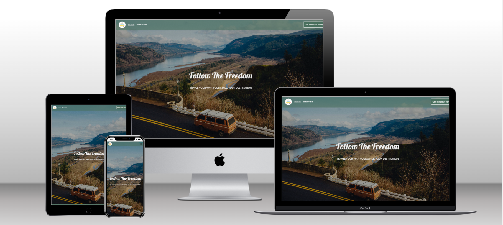
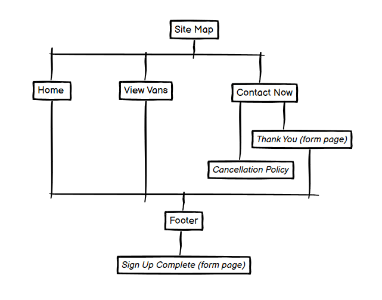

# Luv 4-Wheels 
# Milestone Project 1 - Static Front-End Website 

* DISCLAIMER: Luv 4-wheels is a finctional bussiness. This website for the developers portfolio and completions of Code Institutes course

# Live Poject 

[View live project here](https://jjbr13.github.io/Justin-Brown-milestone-project-one/)

# Repository 

[Locate project reppository here](https://github.com/JJBR13/Justin-Brown-milestone-project-one)

# Contents

- [User Experience](#user-eperience)
   * [User Stories](#user-stroies)
     + [Holiday Bound clients](#holiday-bound-clients)
     + [Limited Holiday Options](#limited-holiday-options)
     + [Travel Broker](#travel-broker)
- [Design](#design)
    + [Colour Pallette](#colour-pallette)
    + [Typography](#typography)
    + [Images](#images)
- [Website Constuction](#website-constuction)
    + [Website Layout](#webpage-layout)
    + [Nav-bar](#nav-bar)
    + [404 Error Page](#404-error-page)
- [Current Features](#current-features)
    + [Responsive On All Devices](#responsive-on-all-devices)
- [Future Releases](#future-releases)
    + [Adding More Content](#adding-more-content)
    + [Booking System](#booking-system)
    + [App](#app)
- [Languages Used](#languages-used)
- [Libaries, Frameworks & Programs](#libaries-frameworks--programs)
- [Deployment](#depolyment)
    + [GitHub Pages](#github-pages)
- [References & Credit](#references--credit)
    + [Logo Creation](#logo-creation)

# User Eperience

## User Stroies 

### Holiday Bound clients 

*These are useres already looking for a holiday been refered by family, friends who have already used the service.*

*Want to see varity and style of campervans advalible to hire. 
*Information on the different vans, allowing educated choice that best suits them. 
*Easy viewing, not stressfull allowing easy contact to be hire desired van for my adventure. 

### Limited Holiday Options 

*Defining the user that may have limitting factors for their holiday away, for example: hates flying or not wanting to leave the contry.*

* Able get a taste of whether this is something for me. 
* Be able to contact support with easy, with concerns or questions may need answered. 
* See previous customer comments, allowing trust within the company. 

### Travel broker 

*Travel agents that work close with the company to book out vans through the year* 

* Travel compainies within the industary that use Luv 4-Wheels to provide options to prosective clients as holiday option.*
* Easy navigating site to me able to show prospective clients the holiday services offered 
* Up to date gallery of images of van and locations travel to create insight and hype to the customer 

## Design 

### Colour Pallette
 
- The simple fresh, natural shceme was selected. To reflect adventures of the outdoor, with the green and blue contrasting whites and to maintain the vibe. 

- This pallette was selected to completment the heavy use of images, to sofen and complement them. While staying true to the vision of the business and clients desires. 

### Typography 

[*Sourced via google fonts.*](https://fonts.google.com/) 

- Heading: used "Lobster" this is a creative, modern flowing font allowing a quirky vibe through the site. 

- Body: Used "Open Sans" commonly with light weight, this font is simple and readable allowing easy processing. 

### Images 

- Imagery was a higly important aspect within this site, as the site aim was to transport the user  into imagening themselves on adventures/ holiday in one of the vans. 

- This was achived throughout the site: 
    - Hero Section on both home and view Van pages were used to capture the attetntion of the user. 
    - The homepage incorporated the "wanderlust gallery", allowing the user to see and picture themseleves within the vans and different locations. 
    - Under each option of van provided a carousel of images sliding indefinately showing images of the specific type of van. 

## Website Constuction 

### Webpage Layout 

 [Click here for Wireframe PDF](assests/img/README/wireframes.pdf)

 

- The website consits of 3 main pages:
  - Hompage: Landing page, featuring links outbound to other pages and wanderlust gallery. 
  - View vans: Provides information on the three types of vans offered to hire. 
  - Contact: Provides contact form to allow the client to enquire or book in.
  - Cancellation policy: Simply page stating the policy of calcellation. 
- All pages have feature buttons/ call to actions or internal links to allow easy, comprehensive navigations through the entirity of the site. Allowing for a better user experience. 

### Nav-bar 

- The Nav-bar was located through-out all pages in the same format to allow consitancy and ease provided when using the site. 
- In desktop & tablet view the nav-bar is horozontally position in list format with a button loacated on right side to contact the company. 
- The nav-bar is not "sticky" allowing for it to disapper with scroll, this was elected for the images and content of the lower blocks could utilise the entirity of the page at all times. 

- The nav-bar is responsive meaning when 325px is reached (mobile devices) the nav-bar moves into hamburger format, allowing the screen not to be conjested. Further the button style is removed and appears as other pages, do within the hamburger dropdown. 

### 404 Error Page 

- This is [.html](https://github.com/JJBR13/Justin-Brown-milestone-project-one/blob/main/404.html) file that has been created and customised to enable the userer to navigate back to the hompage if an error happens when navigating the site. 
-This features in-line CSS styling and a simple link back to the hompage. By having inline styling in there is any issue relates to stlye.css file or bootstrap documentations this page still be active and within selected style. 

### Page creation for form submission

- To allow for a better user experience, the creation of contact-submission.html & sign-up-complete.html were created. This allowed for the user to eaily see the forms had been completed and return back to the homepage decreacing website bounce rate, and continuing the session. 
 
## Current Features 

### Responsive on all Devices 

- This website provides a basic online platform for a rental campervan businssess and has been created using mobile first design which is fully responsive on all screen sizes. 
- Luv 4-Wheels site was created using Bootstrap grid system, flex class and dcoumentaitons allowing website content to look correct through all devices. 

## Future Releases 

### 1 Adding more content

- This site has the ability to have more pages to genterate more traffic to the site. For example: blog page or Adventure maual (please refer to wireframe PDF for design idea) 

### 2 Booking system 

- Allowing the user to book desired van and dates without using the booking form, would be a huge upgrade and user expereice improvemnet. 

### 3 App 

- By using website content and design styling (brand identiy) carry this across to an app with a user database, allowing user profiles. This would create consitancy sense of community. 

## Languages Used 

- [HTML5](https://www.w3schools.com/whatis/whatis_html.asp)
- [CSS3](https://www.w3schools.com/whatis/whatis_css.asp)

## Testing 

- Please follow link to, [TESTME.md](#)

## Libaries, Frameworks & Programs 

## Framework

- [Bootstrap](https://getbootstrap.com/docs/5.2/getting-started/contents/#bootstrap-source-code)
  - Bootstrap v5.2 was used through the entire site to make it responsive. Through using containers, grid system, D-flex and buttom classes. Further sourcing documentation tor produce Nav-bar, contact-form, carousel and buttons.

- [Google Fonts](https://fonts.google.com/)
 - Fonts were selected for the site from the libary and imported to style.CSS file 

- [Github](https://github.com/)
  - Used to create and store the project repository.

- [Gitpod](https://gitpod.io/)
  - Gitpod was installed to create all files and were the code was written.

- [jQuery](https://jquery.com/)
  - jQuery enabling functions of carousel, nav-bar responsitivity and button hover animations 

- [Balsamiq](https://balsamiq.com/)
   -Allowed creation of the wireframes. 

- [Adobe Suite](https://www.adobe.com/uk/)
  - Used to adjust/ enhance images and create the logo for the bussiness. 
  

# Depolyment 

### Github Pages 

1. Log in to [GitHub login](https://github.com/login)
2. Navigate to [GitHub repository](https://github.com/JJBR13/Justin-Brown-milestone-project-one)
3. Locate the navbar at the top of the repository (Not the tope of the web page). Click the Settings tab. 
4. Find the new navbar on the LEFT side. Click "Pages" under sub-heading "Code and automation". 
5. Under "Source", click the dropdown named "None" and select "Main". 
6. Click save, the page will automatically refresh. With a notifcation at the top of the page, with the [link](https://jjbr13.github.io/Justin-Brown-milestone-project-one/) to your published site. 
8. You can return to Github pages section to access the link. 

# References & Credit 

## References

### Media

- [tiny.png](https://tinypng.com/): Used to compress media files to maintain good load speed throughout the site. 
- [Unsplash](https://unsplash.com/), [Pexels](https://www.pexels.com/), [Pixabay](https://pixabay.com/photos/search/) : Open resources to get media files, such as images for hero section and galleries. 
- [Coding.tools](https://coding.tools/hex-to-rgba): Allow ease of convertion of Hex to rgba colours. 

### Logo Creation

- Flat Icon (<a href="https://www.flaticon.com/free-icons/camper" title="camper icons">Camper icons created by Freepik - Flaticon</a>): this allowed the camper van icon to be used and imported. 

## Credit 

- Monika Patel: design layout for the "Feel The Wanderlust" gallery located within the index.html [Find Here](https://codepen.io/IamMonikaPatel/pen/yqGKgj)

- Occasion Help: allowing simple and clear text to be formualted for the cancellation_policy.html [Find Here](https://help.getoccasion.com/article/506-sample-cancellation-and-refund-policies)

- Multi Device Website Mockup Generator: enabling quick, professional mock-up of the site to be used within README.md [Find Here](https://techsini.com/multi-mockup/index.php)