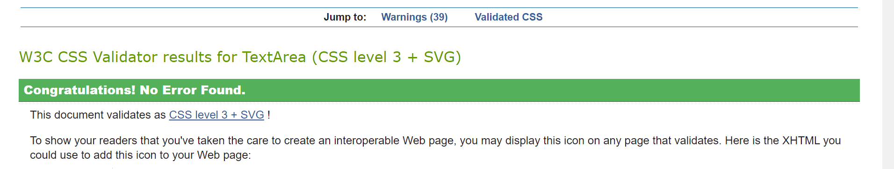
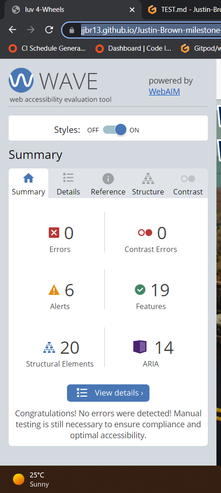
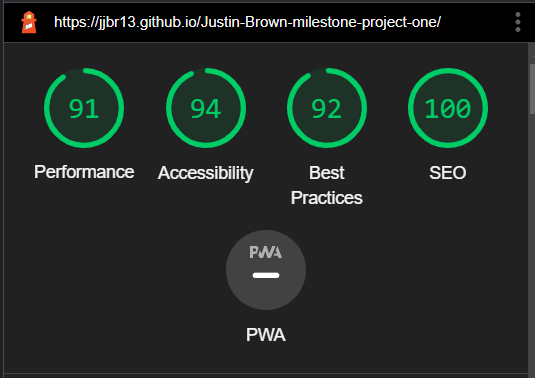
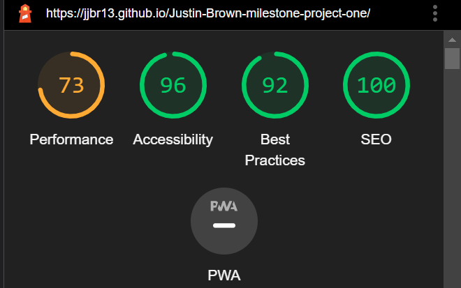

## Issues & Bugs Found

**a) Labels & ids not linked on forms**

**b) Forms submition** 

- post-get, from code institue link to own html pages 

**c) Nav-bar reponsitivity**

- Button remove on phone

**d) Image not loading When live**

- The image carousel on the contact.html page when deplyed 2 of the images fell to default alt text. 

## Validator Testing

- Before testing. the code was formated by shortcuts ctl + K then ctrl + F.

### HTML 

- [W3C](https://validator.w3.org/nu/?doc=https%3A%2F%2Fjjbr13.github.io%2FJustin-Brown-milestone-project-one%2F)

On the intial check this higlighted a problem with headings within the gallery section, see below: 

[HTML Validator first results](assets/img/TEST.md/html_val_varning.png)]

### CSS 

- [W3C](https://jigsaw.w3.org/css-validator/validator) 

This returned no errors, for style.css file. 

### WAVE

- [WAVE](https://wave.webaim.org/) chrome extention was used through-out this website build to highlight aspects that were an issue or missed completly within the code. 

### Lighthouse 

- Lighthouse was used, accessed throuh Developer Tools in Chrome to analyse performance, acessibility, best practice & SEO. This was done for both Desktop and Mobile devices. 

#### Desktop Results

#### Mobile Results 

The above Lighthouse results highlight that there is big acessibility was on all devices with 94% and above. The biggest difference was on performnce from desktop to mobile. Lighthouse highlighted images and redudent CSS libary was the cause for this. 